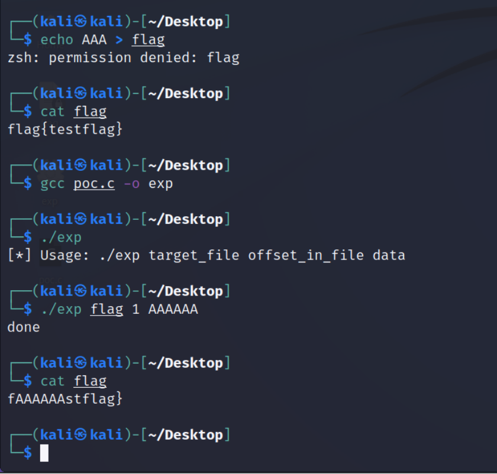
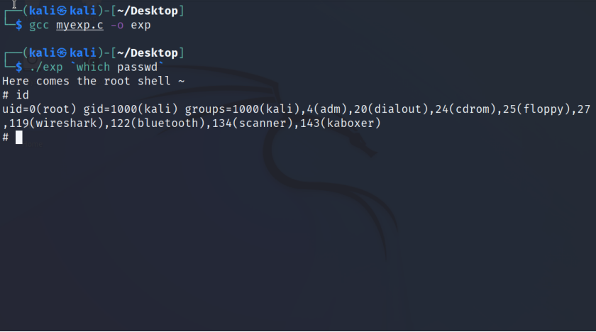

# CVE-2022-0847(Dirty Pipe) 利用

影响范围 >=5.8, <5.16.11, 5.15.25 and 5.10.102

## exp.c

利用该漏洞，覆盖只读文件

  

## exp-root-shell.c

生成执行/bin/sh的shellcode来覆盖有suid且所有者为root的程序，以`passwd`为例，再运行被覆盖的程序就可以拿到shell，实现提权。

（虽然文件的第一个字节不可修改，但只要覆盖的文件与生成的shellcode同为ELF格式，第一个字节就一定是0x7f，不必担心此问题。）

  
